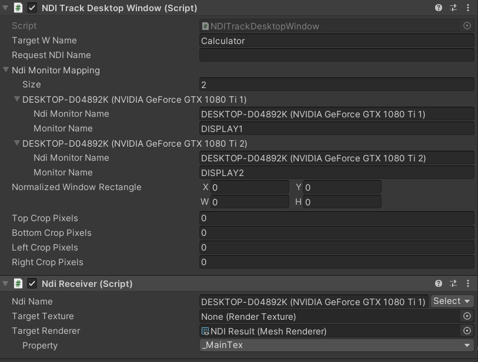

# KlakNDI-Window-Tracker

A utility that lets you track specific windows using KlakNDI <https://github.com/keijiro/KlakNDI>

## Dependencies

Make sure to follow installation instructions here: <https://github.com/keijiro/KlakNDI> before installing

## Installation

Add package to UPM  `https://github.com/gltovar/KlakNDI-Window-Tracker.git#upm`

## How to use

- Add the `NDI Track Desktop Window` Script as a component to an empty game object. Then add an `Ndi Receiver` to the same game object.
- Set `Target W Name` to the window name of the window you want to capture
- If you want to capture a whole screen (in which case, you should just use the Ndi Receiver direction) fill in an ndi name in the `Request NDI Name` field, Leave blank if you are using window capture
- Expand Ndi Monitor Mapping to fill in Monitor Names with NdiNames.  If the mapping array is empty you can use the window from the `Target W Name` drag it from monitor to monitor to get each monitor name.
- There are 2 ways to use this:
  - Put a Renderer in `Ndi Receiver` `Target Renderer` and the `NDI Track Desktop Window` will use that property to adjust the texture properties.
  - Put in a render texture in `Ndi Receiver` Target Texture and write a script that updates the material using that render texture to have offsets and scales from the `Normailzed Window Rectangle`.  X,Y refer to the offset and W,H refer to the scale.

## Issues

There is a problem with ScreenCapture HX, often if you change an NDIReceiver ndiName at run time ScreenCapture HX will crash. Opening windows process manager is required to completely shut it down before relaunching it.  This issue doesn't happen with the regular ScreenCapture. Latest information regarding the issue can be found here: <https://github.com/keijiro/KlakNDI/issues/104>

## Change Log

- 0.7.0
  - Initial Release